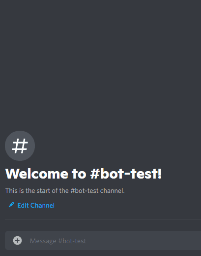
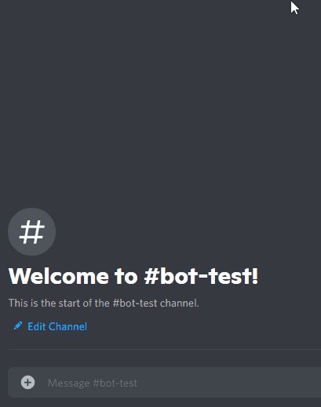

# ITCH.IO-JAM-QUERY-BOT

This is a discord bot for jammers to query their game stat in [itch.io](http://itch.io/jam) jam

## Add bot to your server

[Add Me 😊](https://discord.com/api/oauth2/authorize?client_id=881903969843175425&permissions=2147534848&scope=bot%20applications.commands)

## Scope & Permission

This bot requires the minimual scopes and permission.

### Scope of the bot
- [x] bot
- [x] applications.commands

### Bot
- [x] Send Message
- [x] Embed Link
- [x] Attach Files
- [x] Use Slash Commands

## Commands
`/random [jam name]`: Return a random cool game by jam!

`/game-stats [jam name] [game name]`: Return a cool game by name in a given jam!

`/jam-stats [jam name]`: Return the rating stats of a jam!

